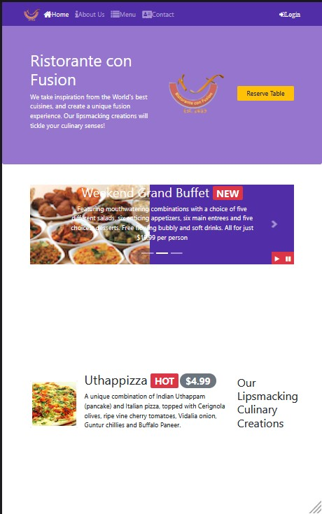

<h1>Ristorante Con Fusion: A BootStrap Website</h1>
<h5>Technology Used:</h5>
<ul>
  <li>HTML/HTML5</li>
  <li>CSS/CSS3</li>
  <li>JavaScript</li>
  <li>BootStrap</li>
  <li>Sass</li>
</ul>
<h5>Tools Used:</h5>
<ul>
  <li>NPM: Package Manager</li>
  <li>Gulp: Build Tool</li>
</ul>
<h5>Quick Start<h5>

<li>To clone: https://github.com/PrinceSingh19/BootStrap-build-with-Gulp-task-runner.git :floppy_disk:</li>
<li>To run: npm start :computer:</li>
<li>To build: npm build</li>

<h5>Project Description</h5>

This project consists the basic structure of a website for a restaurant called Ristorante Con Fusion. The technology stack for the website includes HTML, CSS, JavaScript, and BootStrap. The website consists of various web pages linked to one another namely index.html, aboutus.html, menu.html, and contactus.html. The index.html is the homepage of our website where the menu and various items are listed. It also consists of features like reserve a table where you can reserve tables for an individual to 6 people. It also consists of a login form where you can enter your details and use them to log in to our website.

<h5>What's included :card_index_dividers:</h5>

Within the download you'll find the directories and files, logically grouping common assets and providing both compiled and minified variations.

<h5>Documentation :page_with_curl:</h5>

The brief project report is provided in the project in docs format.

